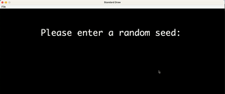

# 2D Tile-Based Game Engine

## Overview

This project is a 2D tile-based game engine built in Java. It supports procedurally generated worlds, user interaction, and saving/loading game state. The game can be controlled either via keyboard input or input strings.

The project follows a structured approach with two parts:
1. **Part 1**: World generation with random seed.
2. **Part 2**: Interactive gameplay, saving/loading functionality, and additional game mechanics.

## Video Walkthrough

Here's a walkthrough of implemented user stories:



## Key Features

### 1. World Generation

- **Procedurally Generated Worlds**: Each world is generated based on a random seed.
- **Rooms and Hallways**: The world includes rectangular rooms and hallways with turns and intersections.
- **Walls and Floors**: Distinct tiles for walls, floors, and unused spaces.
- **Deterministic Output**: Given the same seed, the world is generated identically every time.

### 2. Interactivity

- **Keyboard Controls**:
  - `W` - Move Up
  - `A` - Move Left
  - `S` - Move Down
  - `D` - Move Right
- **Quit and Save**: Press `:Q` to save the game and exit.

### 3. Saving and Loading

- **Save Game State**: This function will be finished later

### 4. Play Modes

- **Interactive Mode**:  
  Start the game with keyboard controls:
  ```bash
  java byog.Core.Main
  ```
  - **Menu Options**:
    - `N` - Start New Game
    - `L` - Load Saved Game
    - `Q` - Quit
