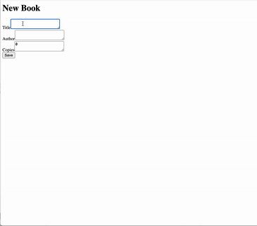

# jrails: A Simple Java Web Framework

## Overview

A simplified web server framework mimic Ruby on Rails, implemented in Java using a Model-View-Controller (MVC) architecture. This project provides a minimal web server that supports basic CRUD operations, routing, and rendering HTML views.

## Video Walkthrough

Here's a walkthrough of implemented user stories:

)

## Project Structure

```
project-root/
│-- jrails/            # jrails framework source code
│-- books/             # Example book app using jrails
│   └── src/main/java/books/
│       ├── Book.java          # Model class for books
│       ├── BookController.java # Controller for handling book requests
│       ├── BookView.java      # View for rendering HTML pages
│       └── Main.java          # Main class to start the server
│-- gradle/            # Gradle build files
│-- build.gradle       # Gradle build configuration
│-- README.md          # Project documentation
```

## How to Build and Run

1. **List all available tasks**:
   ```bash
   ./gradlew tasks
   ```

2. **Build the project**:
   ```bash
   ./gradlew classes
   ```

3. **Run the server**:
   ```bash
   ./gradlew run
   ```

4. Open a web browser and navigate to:
   ```
   http://localhost:8000/test
   ```

## Key Features

### Models
- Extend `jrails.Model` to create database-backed models.
- Annotate fields with `@Column` to specify database columns.
- Supports `save`, `find`, `all`, and `destroy` operations.

### Views
- Generate HTML dynamically using methods like `p()`, `strong()`, `link_to()`, and `form()`.
- Create HTML elements programmatically in Java.

### Controllers
- Handle HTTP requests with controller methods that return `Html` responses.
- Each method takes `Map<String, String>` parameters and returns an `Html` object.

### Routing
- Map HTTP requests to controller methods using `JRouter`.
- Example routes configuration:
  ```java
  JRouter r = new JRouter();
  r.addRoute("GET", "/", BookController.class, "index");
  ```

## Example Application

The included **Book App** demonstrates the basic CRUD operations. Run the server and visit:

- **Home**: `http://localhost:8000/`
- **Show Book**: `http://localhost:8000/show?id=1`
